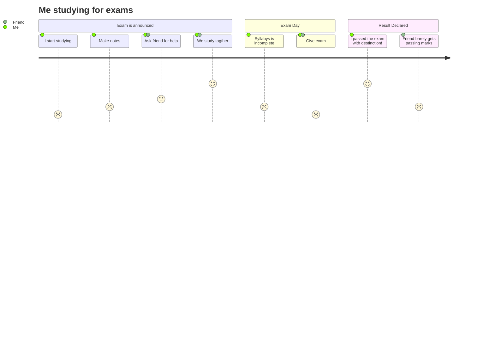
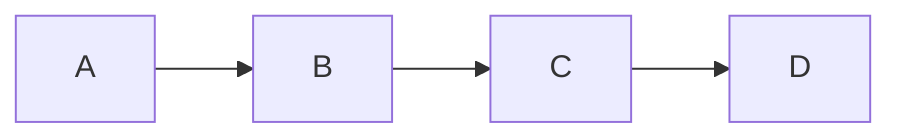
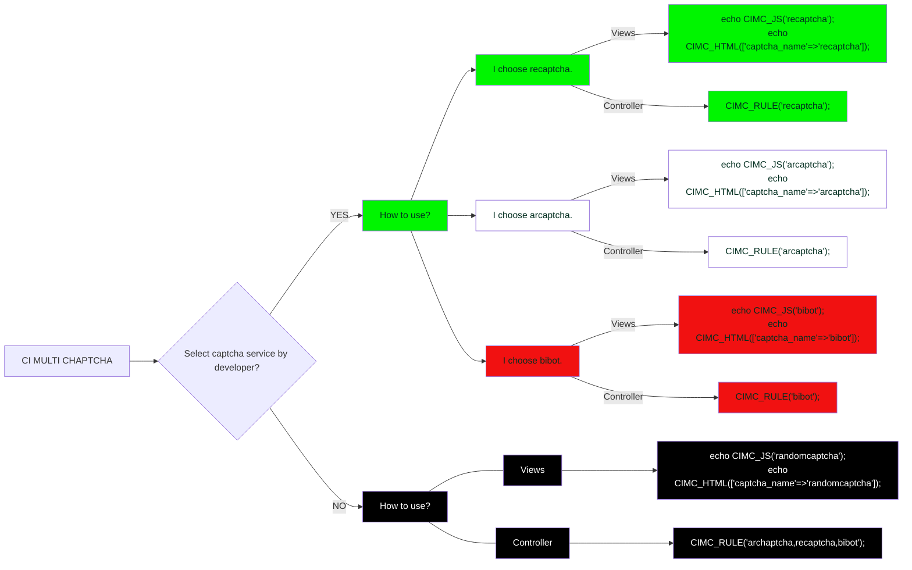

```mermaid
journey
	title Me studying for exams
	section Exam is announced
		I start studying: 1: Me
		Make notes: 2: Me
		Ask friend for help: 3: Me, Friend
		We study togther: 5: Me, Friend
	section Exam Day
		Syllabys is incomplete: 2: Me
		Give exam: 1: Me, Friend
	section Result Declared
		I passed the exam with destinction!: 5: Me
		Friend barely gets passing marks: 2: Friend
```

```mermaid
flowchart LR;
    A-->B;
    B-->C;
    C-->D;
    click A callback "Tooltip for a callback"
    click B "http://www.github.com" "This is a tooltip for a link"
    click A call callback() "Tooltip for a callback"
    click B href "http://www.github.com" "This is a tooltip for a link"
```

```mermaid
  flowchart LR;
      A[CI MULTI CHAPTCHA]-->B{Select captcha service by developer?};
      classDef green color:#022e1f,fill:#00f500;
      classDef red color:#022e1f,fill:#f11111;
      classDef white color:#022e1f,fill:#fff;
      classDef black color:#fff,fill:#000;
      B--YES-->C[How to use?]:::green;
      
      C-->U[I choose recaptcha.]:::green;
      U--Views-->Q["echo CIMC_JS('recaptcha');\n echo CIMC_HTML(['captcha_name'=>'recaptcha']);"]:::green;
      U--Controller-->W["CIMC_RULE('recaptcha');"]:::green;
      
      C-->I[I choose arcaptcha.]:::white;
      I--Views-->O["echo CIMC_JS('arcaptcha');\n echo CIMC_HTML(['captcha_name'=>'arcaptcha']);"]:::white;
      I--Controller-->P["CIMC_RULE('arcaptcha');"]:::white;
      
      C-->X[I choose bibot.]:::red;
      X--Views-->V["echo CIMC_JS('bibot');\n echo CIMC_HTML(['captcha_name'=>'bibot']);"]:::red;
      X--Controller-->N["CIMC_RULE('bibot');"]:::red;
      
      B--NO-->D[How to use?]:::black;
      D---Views:::black-->F["echo CIMC_JS('randomcaptcha');\n echo CIMC_HTML(['captcha_name'=>'randomcaptcha']);"]:::black; 
      D---Controller:::black-->T["CIMC_RULE('archaptcha,recaptcha,bibot');"]:::black;
```
